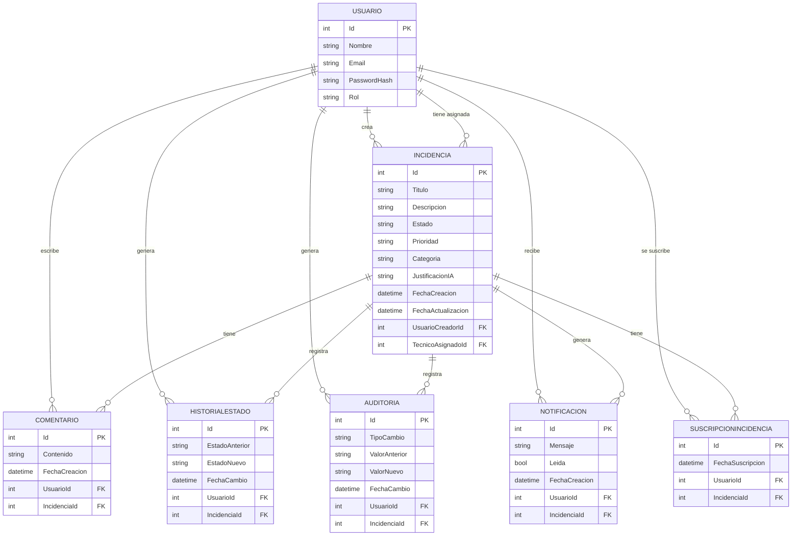

# IncidenciasApp — Marcos Palomo Méndez

Sistema de gestión de incidencias desarrollado como TFG. Permite a usuarios reportar incidencias, a técnicos gestionarlas y a administradores supervisar el sistema desde tres clientes distintos sobre una misma API REST.

---

## Tecnologías

| Capa | Stack |
|------|-------|
| **Backend** | ASP.NET Core 8, Entity Framework Core, PostgreSQL (Npgsql), JWT |
| **Tiempo real** | SignalR (WebSockets) |
| **Email** | MailKit + Mailtrap (sandbox) |
| **Web** | Razor Pages + Bootstrap 5 |
| **Desktop** | WPF (.NET 8) + WebView2 |
| **Shared** | Librería de constantes compartida entre proyectos |
| **Tests** | xUnit + WebApplicationFactory |

---

## Roles

| Rol | Acceso |
|-----|--------|
| `Usuario` | Web — crea y consulta sus propias incidencias |
| `Tecnico` | Web + Desktop — gestiona incidencias asignadas, stats personales, suscripciones |
| `Admin` | Web + Desktop — panel completo: incidencias, usuarios, estadísticas, asistente |

---

## Funcionalidades principales

- **Gestión de incidencias** — CRUD completo con estados, prioridades, categorías y técnico asignado
- **Panel técnico** — stats personales: activas asignadas, resueltas esta semana, tiempo medio de resolución y % SLA cumplido
- **SLA automático** — cada prioridad tiene un límite de tiempo (Crítica 2h, Alta 8h, Media 24h, Baja 72h); las incidencias excedidas se marcan visualmente
- **Notificaciones en tiempo real** — SignalR emite eventos `NuevaIncidencia`, `CambioEstado`, `NuevoComentario` y `NuevaNotificacion` a los clientes conectados
- **Notificaciones email** — al asignar técnico y al cambiar estado; los administradores reciben aviso cuando una incidencia pasa a Resuelta
- **Seguimiento de incidencias** — un técnico puede suscribirse a cualquier incidencia (no solo las suyas) para recibir notificaciones de cambios de estado
- **Auditoría** — cada cambio de estado, técnico o creación queda registrado en la tabla `Auditoria` (quién, qué, cuándo)
- **Clasificación IA** — la API llama a Groq (LLaMA 3) para sugerir categoría y prioridad al crear una incidencia
- **Asistente de consultas** — panel admin con 8 preguntas fijas sobre el sistema (técnico más activo, SLA excedido, tiempo medio, etc.)
- **Exportación** — informes en Excel (EPPlus) y PDF (QuestPDF) descargables desde el panel admin
- **Filtros avanzados** — por estado, categoría, prioridad, SLA, sin asignar, mis incidencias y búsqueda de texto libre

---

## Instalación y ejecución

### Requisitos

- .NET 8 SDK
- Docker Desktop (para PostgreSQL)
- Visual Studio 2022

### 1. Clonar el repositorio

```bash
git clone https://github.com/marcospalomomendez/IncidenciasApp_MarcosPalomoMendez.git
```

### 2. Levantar PostgreSQL con Docker

```bash
docker run --name postgres_asir -e POSTGRES_USER=alumno -e POSTGRES_PASSWORD=alumno123 \
  -e POSTGRES_DB=incidencias -p 5432:5432 -d postgres:16
```

### 3. Configurar la API

Crea `Api/appsettings.Development.json`:

```json
{
  "Jwt": { "Key": "TuClaveSecretaMuyLarga32Caracteres!" },
  "Groq": { "ApiKey": "tu_clave_groq_opcional" },
  "Email": {
    "Smtp": "sandbox.smtp.mailtrap.io",
    "Port": "587",
    "Usuario": "tu_usuario_mailtrap",
    "Password": "tu_password_mailtrap",
    "Remitente": "noreply@incidencias.local"
  }
}
```

### 4. Aplicar migraciones

```bash
cd Api
dotnet ef database update
```

### 5. Arrancar la API

```bash
cd Api
dotnet run
# Escucha en https://localhost:7085
```

### 6. Arrancar el cliente web

```bash
cd Web
dotnet run
# Escucha en https://localhost:7084
```

### 7. Arrancar el cliente desktop

Abrir `Desktop/Desktop.csproj` en Visual Studio y ejecutar con F5.

---

## Endpoints de la API

### Autenticación

| Método | Ruta | Descripción | Auth |
|--------|------|-------------|------|
| POST | `/api/Auth/registro` | Registrar nuevo usuario | Público |
| POST | `/api/Auth/login` | Iniciar sesión, devuelve JWT | Público |

### Incidencias

| Método | Ruta | Descripción | Roles |
|--------|------|-------------|-------|
| GET | `/api/Incidencias` | Listar todas (paginado, filtros) | Autenticado |
| GET | `/api/Incidencias/{id}` | Detalle con comentarios e historial | Autenticado |
| POST | `/api/Incidencias` | Crear incidencia | Autenticado |
| PUT | `/api/Incidencias/{id}` | Actualizar estado y/o técnico | Técnico, Admin |
| DELETE | `/api/Incidencias/{id}` | Eliminar incidencia | Admin |
| GET | `/api/Incidencias/mis` | Incidencias del usuario autenticado | Autenticado |
| GET | `/api/Incidencias/panel-tecnico` | Asignadas al técnico + sin asignar | Técnico, Admin |
| PUT | `/api/Incidencias/{id}/asignar` | Autoasignarse una incidencia | Técnico, Admin |
| GET | `/api/Incidencias/stats` | Estadísticas del dashboard admin | Admin |
| GET | `/api/Incidencias/mis-stats` | Stats personales del técnico | Técnico, Admin |
| GET | `/api/Incidencias/{id}/auditoria` | Historial de auditoría | Admin |
| GET | `/api/Incidencias/suscrito/{id}` | Comprobar si el usuario está suscrito | Técnico, Admin |
| POST | `/api/Incidencias/{id}/suscribir` | Suscribirse a una incidencia | Técnico, Admin |
| DELETE | `/api/Incidencias/{id}/suscribir` | Desuscribirse de una incidencia | Técnico, Admin |
| GET | `/api/Incidencias/consulta` | Consulta del asistente | Admin |

### Comentarios

| Método | Ruta | Descripción | Roles |
|--------|------|-------------|-------|
| GET | `/api/Comentarios/{incidenciaId}` | Listar comentarios | Autenticado |
| POST | `/api/Comentarios` | Añadir comentario | Autenticado |
| DELETE | `/api/Comentarios/{id}` | Eliminar comentario | Admin |

### Usuarios

| Método | Ruta | Descripción | Roles |
|--------|------|-------------|-------|
| GET | `/api/Usuarios` | Listar todos | Admin |
| PUT | `/api/Usuarios/{id}/rol` | Cambiar rol | Admin |

### SignalR Hub

`/hubs/incidencias` — el token JWT se pasa como query string `?access_token=`.

| Evento | Destinatario | Payload |
|--------|-------------|---------|
| `NuevaIncidencia` | Grupo `admins` | id, titulo, categoria |
| `CambioEstado` | Grupo `admins` + `tecnico-{id}` + `user-{id}` | id, estado |
| `NuevoComentario` | Grupos relevantes | id, contenido, autor |
| `NuevaNotificacion` | Grupo `user-{id}` | mensaje |

---

## Estructura del proyecto

```
IncidenciasApp/
├── Api/
│   ├── Controllers/        # AuthController, IncidenciasController, ComentariosController, UsuariosController
│   ├── DTOs/               # Objetos de transferencia con validaciones
│   ├── Models/             # Usuario, Incidencia, Comentario, HistorialEstado, Auditoria,
│   │                       # Notificacion, SuscripcionIncidencia
│   ├── Data/               # AppDbContext (EF Core)
│   ├── Hubs/               # IncidenciasHub (SignalR)
│   ├── Services/           # ClasificadorService (Groq IA), EmailService (MailKit)
│   └── Migrations/
├── Api.Tests/              # Tests de integración (xUnit + WebApplicationFactory)
├── Web/
│   ├── Pages/
│   │   ├── Admin/          # Index, Incidencias, Usuarios, Detalle, Asistente, ExportarExcel, ExportarPdf
│   │   ├── Tecnico/        # Index (con stats), Detalle
│   │   └── Usuario/        # Index, Crear, Detalle
│   └── Models/
├── Desktop/
│   └── Views/              # LoginPage, IncidenciasPage, DetallePage
└── Shared/                 # Constantes: Roles, Estados, Prioridades, Categorias
```

---

## Tests

El proyecto incluye tests de integración en `Api.Tests/` que prueban los endpoints reales con base de datos en memoria.

```bash
dotnet test Api.Tests/Api.Tests.csproj
```

| Suite | Descripción |
|-------|-------------|
| `AuthTests` | Registro, login, validaciones |
| `IncidenciasTests` | CRUD, roles, stats, asignación |
| `UsuariosTests` | Gestión de roles, protección último admin |
| `ComentariosTests` | Crear, listar, eliminar |

---

## Modelo entidad-relación



---

## Ciclo de vida de una incidencia

```
Abierta → EnProceso → Resuelta → Cerrada
```

Cada cambio de estado queda registrado en `HistorialEstado` y en `Auditoria`.

## SLA por prioridad

| Prioridad | Tiempo máximo |
|-----------|--------------|
| Crítica | 2 horas |
| Alta | 8 horas |
| Media | 24 horas |
| Baja | 72 horas |
